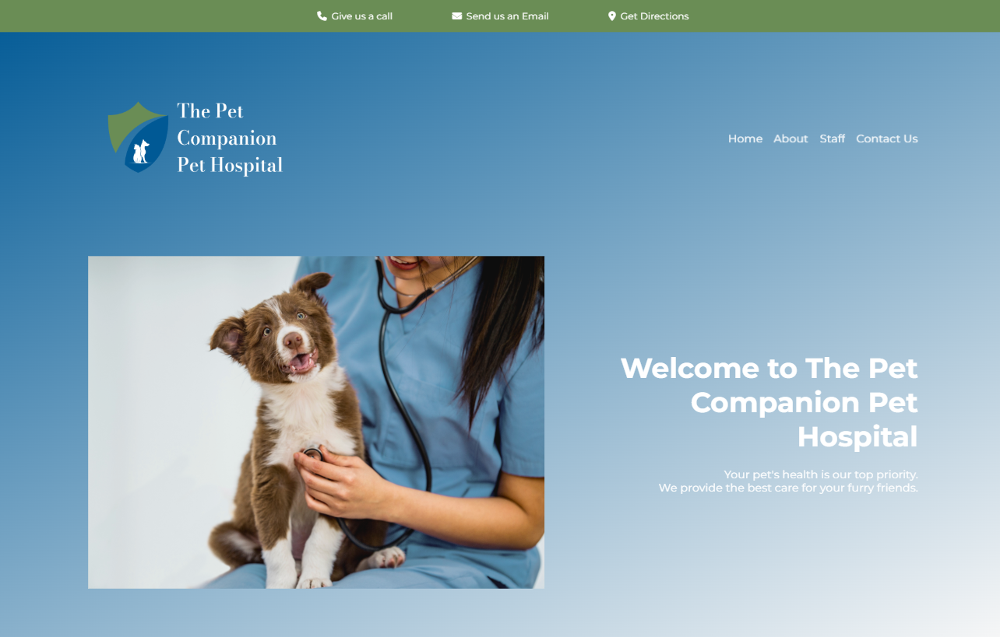
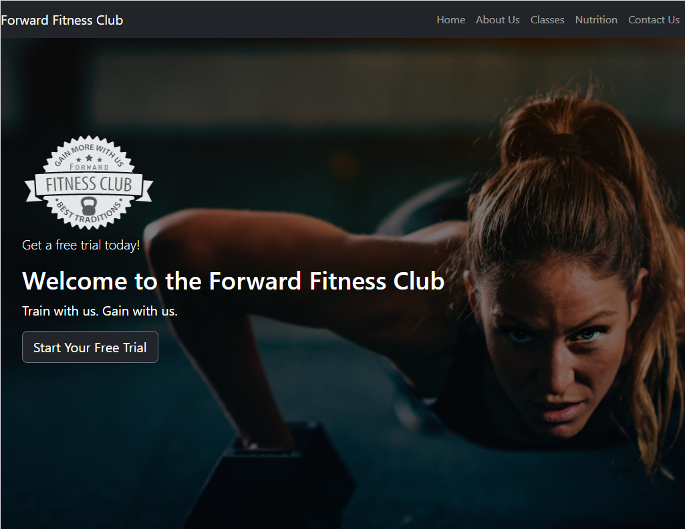
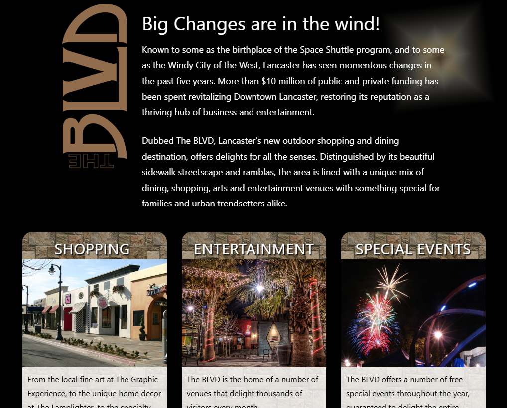
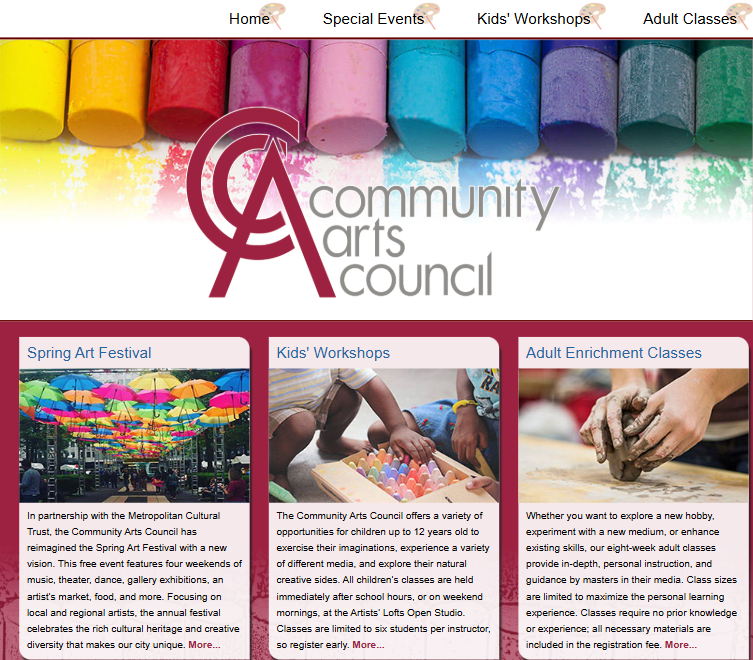
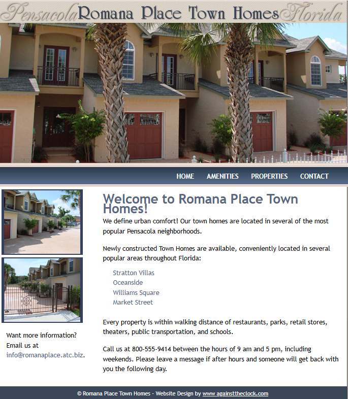
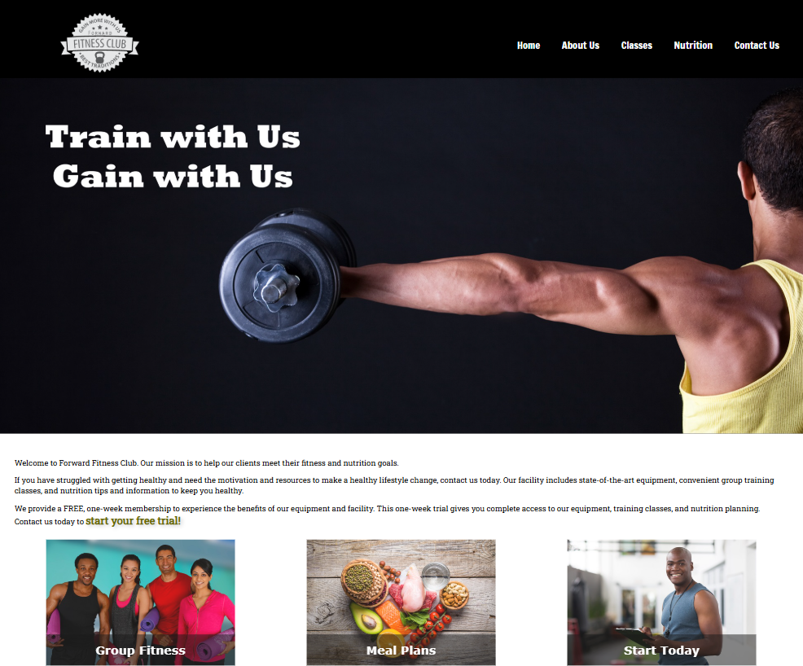

These are just a few projects that reflect my education in HTML and CSS over fall and spring semester at NDSCS (2024-2025). 

If the live version is available it is marked with ✔️ If the live version is not available (the code is!) it is marked with ❌.

Thanks for stopping by!

 
 
 
The Pet Companion Pet Hospital - Veterninary Clinic

<a href="https://petcompanionpethospital.netlify.app/">View it live</a> ✔️

Features: HTML, CSS, Responsive Design (Mobile, Tablet, Desktop).

Design elements include: Custom Logo, Photoshop Editing, CSS animations

Project status: ✔️ Fully Completed.

 
 
 

Fitness - Bootstrap | The Forward Fitness Club

View it live: Unavailable ❌ Be sure to check out the code!

Features: HTML, CSS, Bootstrap, Responsive Design (Mobile, Tablet, Desktop).

Design elements include: CSS animations, Boostrap elements including Jumbotron, text containers, columns, and more.

Project status: ✔️ Fully Completed.

 
 
 

BLVD | The Boulevard

View it live: Unavailable ❌ Be sure to check out the code!

Features: HTML, CSS, Responsive Design (Mobile, Tablet, Desktop).

Project status: ✔️ Fully Completed.

 
 
 

CAC | Community Arts Council

View it live: Unavailable ❌ Be sure to check out the code!

Features: HTML, CSS, CSS animations.

Project status: ✔️ Fully Completed.

 
 
 

Rentals | Pensacola Rentals Project

View it live: Unavailable ❌ Be sure to check out the code!

Features: HTML, CSS, CSS animations.

Project status: ✔️ Fully Completed.

 
 
 

Fitness | Forward Fitness Club

View it live: Unavailable ❌ Be sure to check out the code!

Features: HTML, CSS, CSS animations

Project status: ✔️ Fully Completed.

